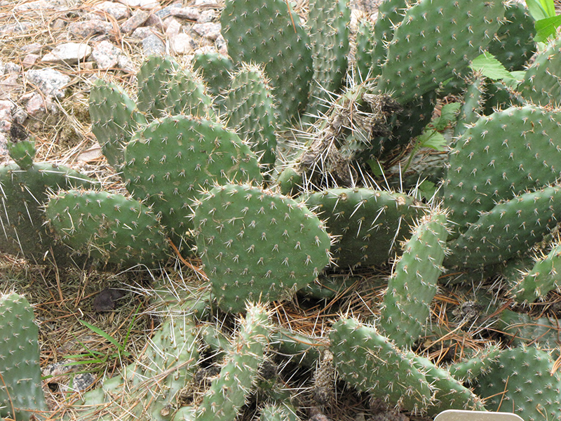
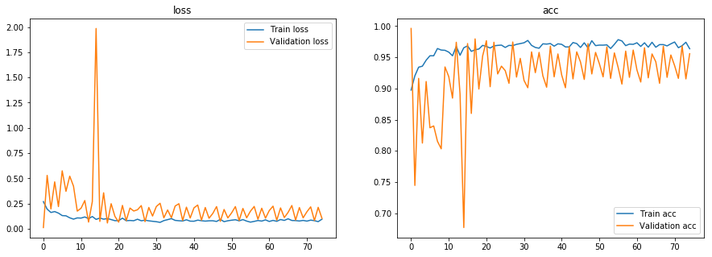
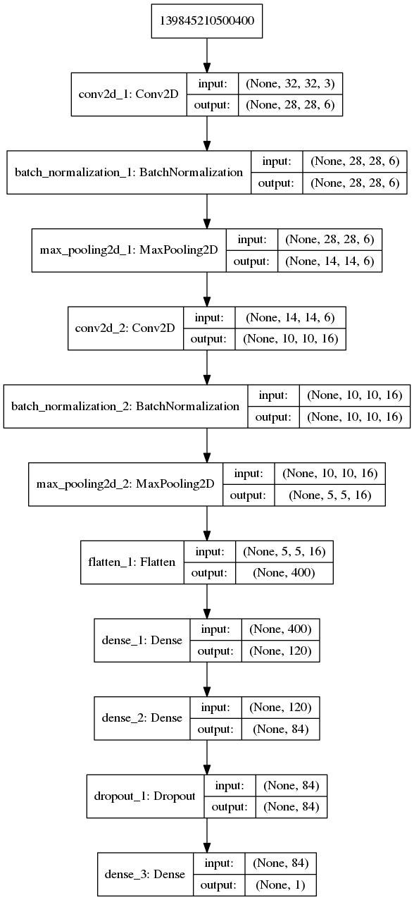

# Aerial Cactus Keras Image Classification
### In this project I take the satellite images taken for autonomous field detection to classify cactus's within the field. I follow the research paper experiment and use the LeNet-5 Convolutional Neural Network architecture. I use data augmentation to get the model to a 95% accuracy.

# Dataset:
### https://www.kaggle.com/irvingvasquez/cactus-aerial-photos
### In this dataset, we are presenting more than 16,000 examples of a columnar cacti (Neobuxbaumia tetetzo) for plant recognition or classification.

# Research Paper:
### Here is the link to the research paper that contains the experiment and network architecture. Also this paper explains the dataset and the purpose for this expirement.
### https://jivasquez.files.wordpress.com/2019/03/rp_cactus_recognition_elsa-1.pdf

